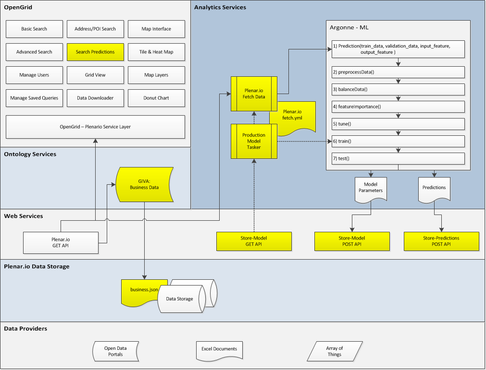

# Smart Data Platform

Smart Data Platform helps automate analytics in cities. The platform grabs data from multiple city systems which allows users to explore in a single map and provides predictions to help cities operate efficiently and practively.

Below are links to the principal components of the [Smart Data Plaform](http://mayorschallenge.bloomberg.org/ideas/the-chicago-smartdata-platform/). The project is developed through a consortium of partners, including University of Chicago, Argonne National Laboratories, DePaul University, University of Illinois at Chicago, and Smart Chicago Collaborative. Each institution owns the code developed, but have made it open source.

## Components

Smart Data Platform consists of several principal components: a user interface which allows users to explore historical data as well as future predictions, analytics services which actually performs the predictions, ontology layer which combines data (namely, matches all business-level data with any records pertaining to businesses), and a data services layer which stores data and makes it available through an API.

[Download original file (Visio)](docs/Smart Data Platform Architecture.vsd)

### User Interface
Provides a user interface that lets users navigate data from multiple sources on a simple, easy to use map.

* [OpenGrid](http://opengrid.io) ([repo](https://github.com/Chicago/opengrid)) - City of Chicago
* [OpenGrid-Plenario service layer repositories](https://github.com/smartchicago/opengrid-svc-plenario) - Smart Chicago Collaborative

### Analytics Services
Allows users to fetch data and find features that predict binary outcomes (e.g., inspections) with minimal human involvement.

* [SPUDS](https://xgitlab.cels.anl.gov/groups/urban-analytics) - Argonne National Laboratories
* [predictions.json](https://github.com/Chicago/sdp-predictions.json)
* [Feature Fetcher](https://github.com/Chicago/sdp-feature-fetcher)

### Ontology Layer
Takes raw data from Plenario and combines all records related to businesses in a single file.

* [GIVA repo](https://gitlab.com/advis/giva) - University of Illinois, Chicago
* [business.json](https://github.com/Chicago/sdp-business.json)

### Data Services
Stores location and event data from multiple sources and provides it through an easy API.

* [Plenar.io](http://plenar.io/) ([repo](https://github.com/UrbanCCD-UChicago/plenario)) - University of Chicago, Computation Institute

## Acknowledgements

Smart Data Plaform is principally funded by the Bloomberg Philanthropies through the [Mayor's Challenge award](http://mayorschallenge.bloomberg.org/).
